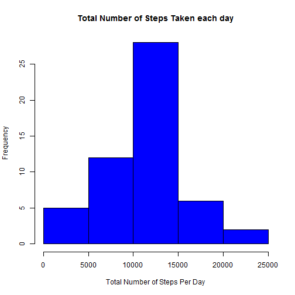
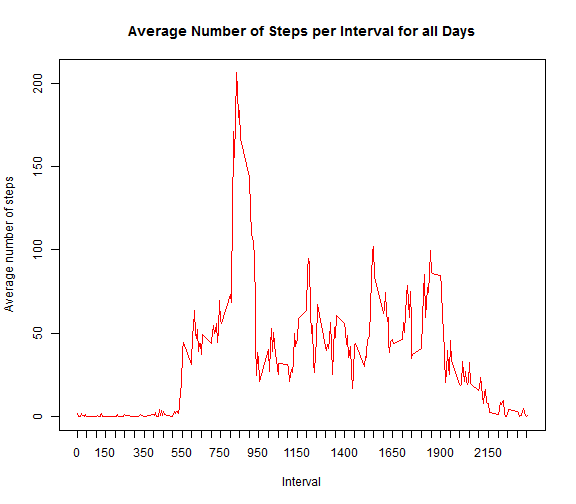
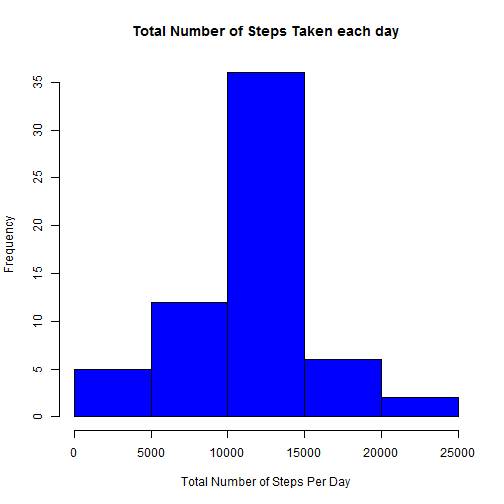
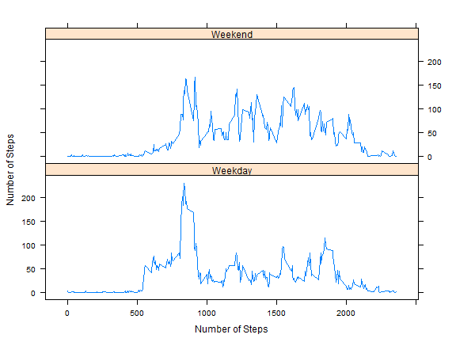

## Loading and preprocessing the data

```r
Data<-read.csv("activity.csv",header=TRUE,stringsAsFactors=FALSE)
library(plyr)
Data_Per_Day<-ddply(Data,"date",summarize,TNS=sum(steps)) #TNS : Total Number of Steps
```

## What is mean total number of steps taken per day?

```r
hist(as.numeric(Data_Per_Day$TNS),xlab = "Total Number of Steps Per Day",col="blue",main="Total Number of Steps Taken each day")
```

 

```r
Mean<-mean(Data_Per_Day$TNS,na.rm=TRUE)
Median<-median(Data_Per_Day$TNS,na.rm=TRUE)
```
The mean of the total number of step taken per day is 10766. and the Median is 10765 .

## What is the average daily activity pattern?

```r
Data_Per_interval<-ddply(Data,"interval",summarize,MNS=mean(steps,na.rm=TRUE)) 
plot(Data_Per_interval$interval,Data_Per_interval$MNS,ylab="Average number of steps",xlab="Interval",type="l",col="red",xaxt="n",main="Average Number of Steps per Interval for all Days")
at <- seq(from = 0, to = max(Data_Per_interval$interval), by = 50)
axis(side = 1, at = at)
```

 

```r
Interval_W_Max_number_Steps<-Data_Per_interval[which.max(Data_Per_interval$MNS),1]
```
The 5-minute interval, on average across all the days in the dataset which contains the maximum number of steps
is 835. 

## Imputing missing values
I imputed the missing values by taking the mean of number of steps for each particular interval and assinging it 
to the missing value which have the same interval value .

```r
Missing_Values<-sum(is.na(Data))
Imputed_Data<-Data
for(i in 1:nrow(Data)){
        if(is.na(Data$steps[i])){
                Imputed_Data[i,1]<-Data_Per_interval[Data_Per_interval$interval==Data$interval[i],2]
                }
        }

Imputed_Data_Per_Day<-ddply(Imputed_Data,"date",summarize,TNS=sum(steps)) #TNS : Total Number of Steps   
hist(as.numeric(Imputed_Data_Per_Day$TNS),xlab = "Total Number of Steps Per Day",col="blue",main="Total Number of Steps Taken each day")
```

 

```r
IMean<-mean(Imputed_Data_Per_Day$TNS,na.rm=TRUE)
IMedian<-median(Imputed_Data_Per_Day$TNS,na.rm=TRUE)
```
The nubmer of the missing values is 2304 The mean of the total number of step taken per day(after imputing the missing values) is 10766. and the Median is 10766 .

## Are there differences in activity patterns between weekdays and weekends?

```r
New_Imputed_Data<-mutate(Imputed_Data,DayType=weekdays(as.Date(Imputed_Data$date)))
for(i in 1:nrow(Imputed_Data))
        {
        if(New_Imputed_Data$DayType[i]=="Sunday"|New_Imputed_Data$DayType[i]=="Saturday") 
                New_Imputed_Data$DayType[i]<-"Weekend"
        else 
                New_Imputed_Data$DayType[i]<-"Weekday"
        }
New_Imputed_Data$DayType<-as.factor(New_Imputed_Data$DayType)
Data_Per_interval_Day<-ddply(New_Imputed_Data,c("interval","DayType"),summarize,MNS=mean(steps))
library(lattice)
 xyplot(MNS~interval|factor(DayType),data = Data_Per_interval_Day,ylab="Number of Steps",xlab="Number of Steps",layout=c(1,2),type="l")
```

 


`


